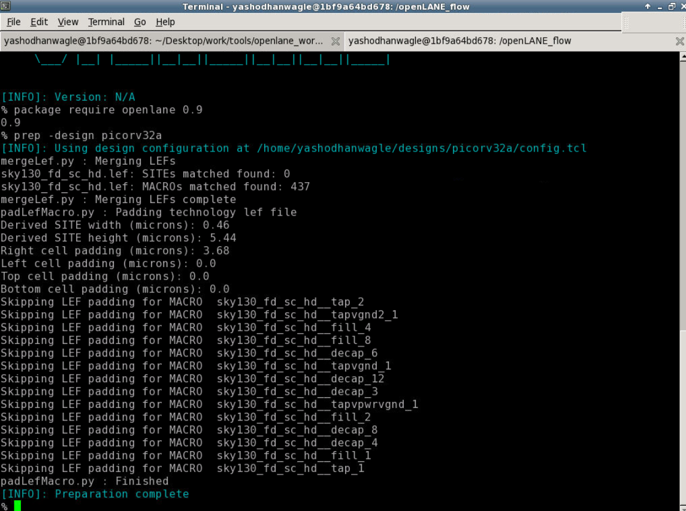
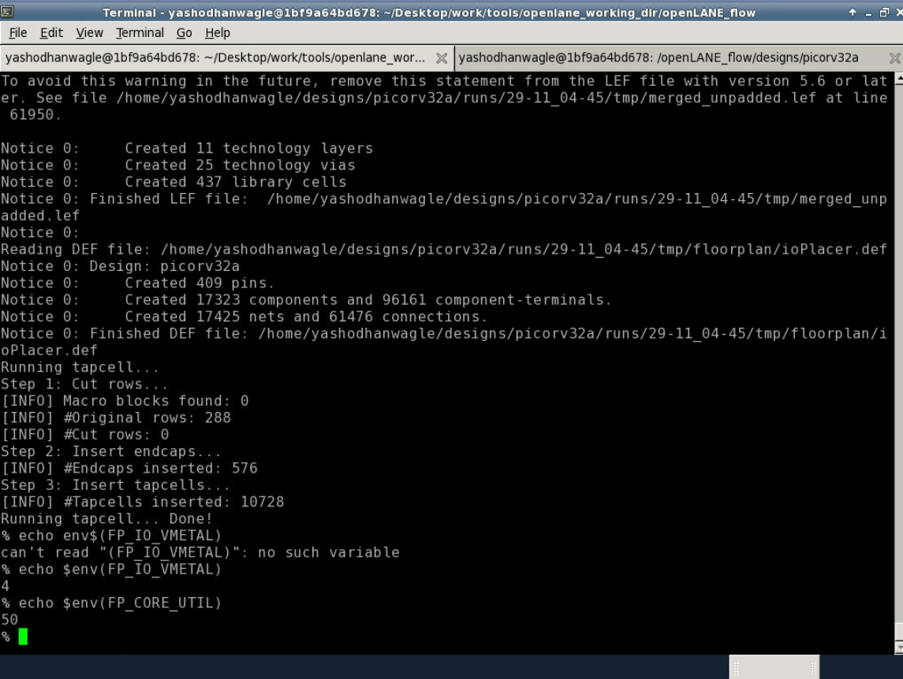

This repo is an attempt at and a tutorial for the OpenLane Physical Design Flow

# Table of Contents

* RTL2GDS flow
* Introduction to OpenLANE
* Synthesis
* Floorplan
* Placement
* Standard cell design and characterization
* Timing Analysis
* Clock Tree Synthesis
* Routing
* DRC

# RTL2GDS flow

# Introdction to OpenLANE

## Invoking OpenLANE: 

Preparation for Synthesis:

# Synthesis

Synthesis Statistics:

Snapshot of the Netlist:

# Floorplan

Floorplanning logs and edits:

SkyLake130 config.tcl (highest priority):

Floorplan Custom config.tcl:

Floorplan Default config.tcl (lowest priority):

Environment Variables:

Floorplan def file:

## Invoking Magic

Floorplan Analysis on Magic:

# Placement

