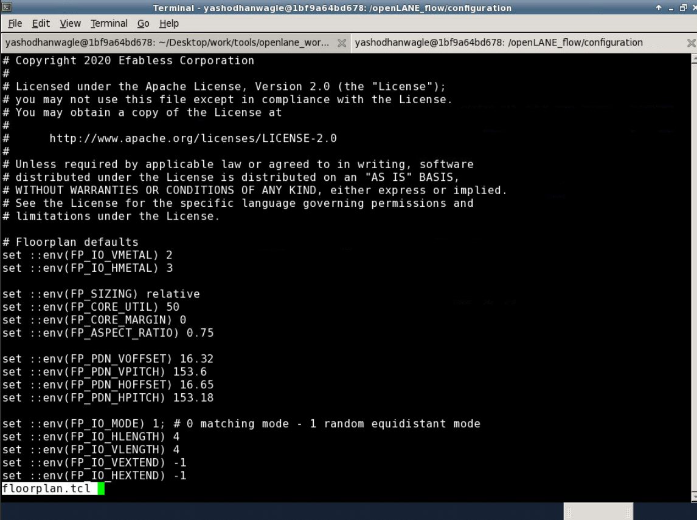
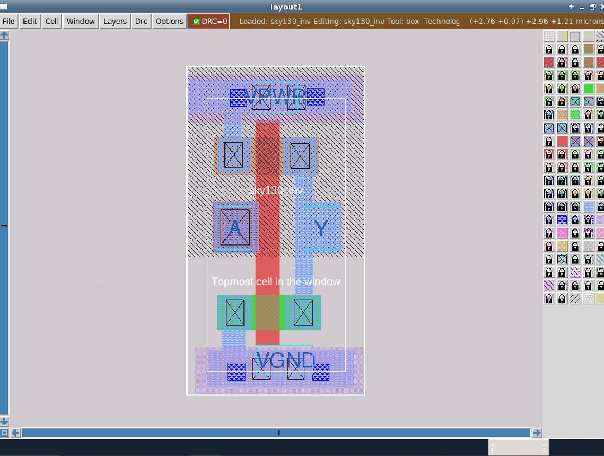

This repo is an attempt at and a tutorial for the OpenLane Physical Design Flow

# Table of Contents

* RTL2GDS flow
* Introduction to OpenLANE
* Synthesis
* Floorplan
* Placement
* Standard cell design and characterization
* Timing Analysis
* Clock Tree Synthesis
* Routing
* DRC

# RTL2GDS flow


# Introdction to OpenLANE


## Invoking OpenLANE: 


Preparation for Synthesis:


# Synthesis


Synthesis Statistics:


Snapshot of the Netlist:


# Floorplan


Floorplanning logs and edits:


SkyLake130 config.tcl (highest priority):


Floorplan Custom config.tcl:


Floorplan Default config.tcl (lowest priority):


Environment Variables:


Floorplan def file:


## Invoking Magic


Floorplan Analysis on Magic:


# Placement


Placement on Magic:


# Standard cell design and characterization
Cloning the required custom cell files:


Custom Inverter Cell on Magic:


Export to Ngspice for analysis:


Spice file:


## Invoke ngspice


Transient Analysis of Custom Inverter Cell:


Lef file of Custom Inverter Cell:


Lib file for inclusion of custom cell:


Custom config for inclusion of custom cell:


Synthesis prep witj custom inverter cell:


Synthesis:


# Timing Analysis
Synthesis with better slack: 


Floorplan with custom Inverter cell:


Placement with Custom Inverter celll:


Placement of custom inverter cell on Magic:


# Clock Tree Synthesis
Command for CTS. Ran with the default config. 
```
run_cts
```
The output of CTS stage will provide a new netlist in ~/results/synthesis/ folder name picorv32a.synthesis_cts.v

# Routing

# DRC
